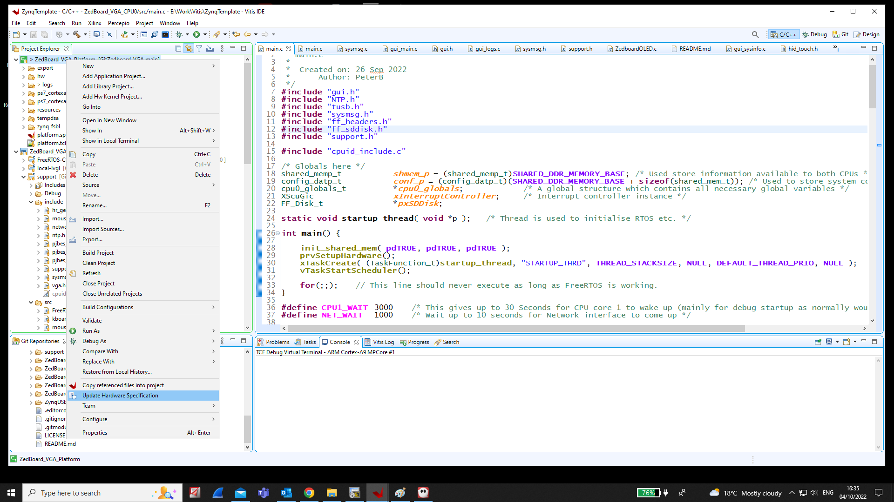
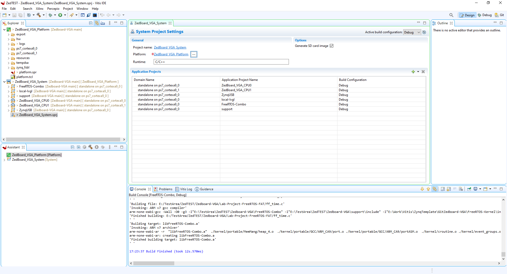
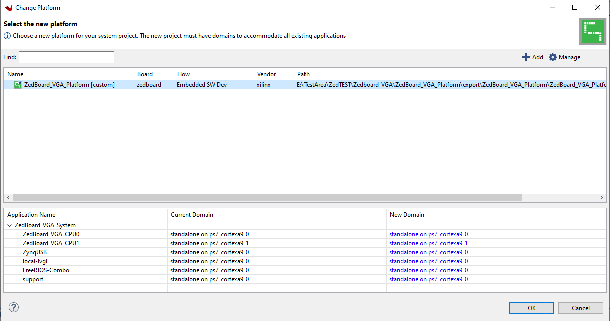
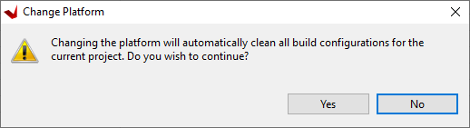

# Zedboard-VGA
Due to being very grateful for the existence of open source projects such as FreeRTOS, LVGL and TinyUSB, this is an implementation of asymetrical multi-processing (AMP) FreeRTOS +TCP +FAT with LVGL graphics library driving custom 'VGA' IP implemented in the FPGA fabric for the Zedboard.  I just wanted to give something back to the community and hopefully this will prove a useful template for the Zedboard/Xilinx Zynq 7000 platform. See: https://www.avnet.com/wps/portal/us/products/avnet-boards/avnet-board-families/zedboard/ and: https://www.xilinx.com/products/silicon-devices/soc/zynq-7000.html

**Notes about implementation**

***ARM Core 0*** runs an instance of FreeRTOS implementing the FAT file system, the TCP/IP stack and the graphics library.

***ARM Core 1*** also runs an instance of FreeRTOS with just one task which drives the Zedboard OLED display.

Currently the home grown fabric VGA interface has worked successfully up to a resolution of 1440 x 900 @ 60 Hz.  The configuration set for the example is 1024 x 768 @ 60 Hz.  There are a number of standard resolutions defined in the code which can be used, but currently there is no dynamic selection, a resolution change requires a new firmware build.  It wouldn't be difficult to add some code to change the display resolution at runtime and you could also create your own table entries for other resolutions. This site is a good source of VGA parameters: http://tinyvga.com/vga-timing 

There is a very basic implementation of USB HID for keyboard, mouse and touch screen, which is heavily based on the Github TinyUSB project from @hathachX see here:
https://github.com/hathach/tinyusb
I have modified this code to work with the 'Zynq' in a non-cached way and created a couple of source files which contain the 'Zynq' specific implementation.

I have implemented a basic tab based GUI which enables configuration of the basics for a FreeRTOS +TCP/IP based system along with the primary colour of the GUI and the Dark/Light theme.  There is an SD based file system using FreeRTOS +FAT on which a rudimentary log system has been implemented.  There is a basic FTP server, enabling access to the file system to collect the log and configuration file, it also enables the update of the BOOT.BIN file on the system for firmware update.  I have implementated the LVGL widgets demo on a tab in the GUI also.  There is a 'System Info' tab which shows the FreeRTOS tasks and stats this is not particularly great for a production system though as it is quite CPU hungry.

**To get started with the project.** 
Required Hardware:
Zedboard with SD card installed, if a USB mouse is used a VGA compatable monitor connected to the Zedboard VGA connector or a Touch screen connected to the VGA port and the USB port (See links below for Waveshare(Ilitek touch) screens I have used.) \
https://www.waveshare.com/product/displays/lcd-oled/lcd-oled-1/13.3inch-hdmi-lcd-h-with-case.htm \
https://www.waveshare.com/product/displays/lcd-oled/lcd-oled-1/15.6inch-hdmi-lcd-h-with-case.htm \
**NOTE: for Waveshare screens VGA connection, this cable is also required:**
https://www.waveshare.com/Mini-HDMI-Male-to-VGA-Female-Cable.htm

1. Using Xilinx's Vitis development environment create a new workspace, and clone this repository to a new sub-folder with in the new workspace directory, tick the box to *'Clone submodules'* and the box to *'Import all existing Eclipse projects after clone finishes'* \

2. When the projects have cloned and imported go to the C/C++ View or the Design View and right click on the *'Zedboard_VGA_platform'* project and select *'Update Hardware Specification'* and select the file *\YourWorkspacePath\ZedBoard_VGA_FPGA\design_1_wrapper.xsa* Without doing this step Vitis doesn't seem to update all the paths associated with the platform correctly \

3. Now build the *'Zedboard_VGA_platform'*
4. Next double click the *'ZedBoard_VGA_System.sprj'* file from the Vitis Explorer:

5. Click the the three dots next to Platform name and click '+ Add' and navigate to the path *'\YourWorkspacePath\ZedBoard_VGA_Platform'* and click select folder. You should end up with a window something like this:

6. Now select the *'ZedBoard_VGA_Platform[custom]'* entry in the table and click OK.
7. Click **Yes** on the next box: \

8. Now build the *'FreeRTOS-Combo'*, *'local-lvgl'*, *'support'* and *'ZynqUSB'* library projects.
9. Once complete build the *'ZedBoard_VGA_CPU0'* and *'ZedBoard_VGA_CPU1'* projects.

You are now ready to either create a debug session and load the code over jtag into the Zedboard via USB or you can build the *'ZedBoard_VGA_System'* project and copy the *'ZedBoard_VGA_System\Debug\sd_card\BOOT.BIN'* file to your SD card then insert it into the Zedboard and it should boot the project.

You can connect a serial terminal @ 115200 BAUD to the USB UART port on the Zedboard to see various monitoring messages during boot and operation.

***NOTE: If you need to edit the fabric/Zynq configuration or add to the project, I have also included the Vivado project here in the folder 'Zedboard_VGA_FPGA' it is not easy to make this work well with Github but if you take the folder structure and copy it to your work area and open the Vivado project it should work.  You may need to set up the user repository so it can see the IP projects in the folder.***
