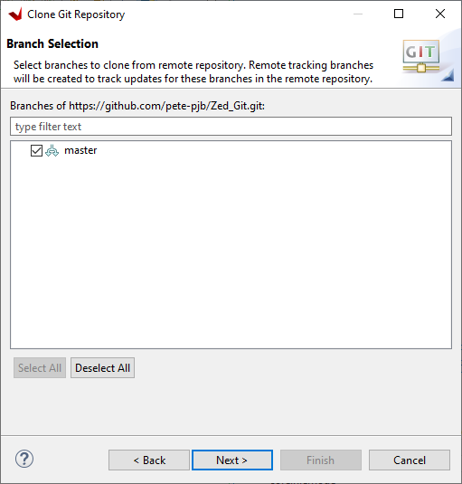

# Zedboard VGA template project
Due to being very grateful for the existence of open source projects such as FreeRTOS, LVGL and TinyUSB, this is an implementation of asymetrical multi-processing (AMP) FreeRTOS +TCP +FAT with LVGL graphics library driving custom a 'VGA' IP implemented in the FPGA fabric for the Zedboard.  I just wanted to give something back to the community and hopefully this will prove a useful template for the Zedboard/Xilinx Zynq 7000 platform. See: https://www.avnet.com/wps/portal/us/products/avnet-boards/avnet-board-families/zedboard/ and: https://www.xilinx.com/products/silicon-devices/soc/zynq-7000.html

## **Notes about implementation**

***ARM Core 0*** runs an instance of FreeRTOS implementing the FAT file system, the TCP/IP stack and the graphics library.

***ARM Core 1*** also runs an instance of FreeRTOS with just one task which drives the Zedboard OLED display.

Currently the home grown fabric VGA interface has worked successfully up to a resolution of 1440 x 900 @ 60 Hz.  The configuration set for the example is 1024 x 768 @ 60 Hz.  There are a number of standard resolutions defined in the code which can be used, but currently there is no dynamic selection, a resolution change requires a new firmware build.  It wouldn't be difficult to add some code to change the display resolution at runtime and you could also create your own table entries for other resolutions. This site is a good source of VGA parameters: http://tinyvga.com/vga-timing 

There is a very basic implementation of USB HID for keyboard, mouse and touch screen, which is heavily based on the Github TinyUSB project from @hathachX see here:
https://github.com/hathach/tinyusb
I have modified this code to work with the 'Zynq' in a non-cached way and created a couple of source files which contain the 'Zynq' specific implementation.

## Parts of the implementation:  

1. A basic tab based GUI which enables configuration of the basics for a FreeRTOS +TCP/IP based system along with the primary colour of the GUI and the Dark/Light theme.
2. An SD based file system using FreeRTOS +FAT on which a rudimentary log system has been implemented.
3. A basic FTP server, enabling access to the file system to collect the log and configuration file, it also enables the update of the BOOT.BIN file on the system for firmware update.
4. I have implementated the LVGL widgets demo modified to run on a tab in the GUI also.  
5. There is a 'System Info' tab which shows the FreeRTOS tasks and stats.

## **A walk through to get started with the project.** 
Required Hardware:
Zedboard with SD card installed, a USB mouse can be used with a VGA compatable monitor connected to the Zedboard VGA connector, or a Touch screen connected to the VGA port and the USB port (See links below for Waveshare(Ilitek touch) screens I have used.) \
https://www.waveshare.com/product/displays/lcd-oled/lcd-oled-1/13.3inch-hdmi-lcd-h-with-case.htm \
https://www.waveshare.com/product/displays/lcd-oled/lcd-oled-1/15.6inch-hdmi-lcd-h-with-case.htm \
**NOTE: for Waveshare screens VGA connection, this cable is also required:**
https://www.waveshare.com/Mini-HDMI-Male-to-VGA-Female-Cable.htm
You will very likely need a usb OTG adapter to attach a mouse or touch screen.  

### ***Here is a 'suggested' approach to adding the project to the Xilinx Vitis development environment.***

This approach allows the project to connect to the various git repositories on line that are required and maintain links to the currently checked out versions of the third party libraries etc.

The project is set up to work with the following directory structure choosing your own name and location for the Project_Root_Folder(for this example we are using 'E:\ZedTemplate'), **Note: the subfolder names must be as specified here for the relative paths to work in the Vitis environment)**:

Go ahead and create the root folder of your own name and path for the project and add the subfolders 'Zed_GitSubs' and 'Zed_WS' (Note: The 'Zed_Git' Folder will be created by Vitis later.)

  
			  
### ***1. Open the Xilinx Vitis environment and specify a new workspace as per the description above.***

### ***2. Open the Vitis Git perspective and add the submodules one at a time selecting 'Clone a Git repository'(Tip: If you copy the url for the repository prior to clicking 'Clone a Git repository it will automatically fill in the next window for you):***
  
**Firstly the FreeRTOS Kernel**  
https://github.com/FreeRTOS/FreeRTOS-Kernel.git  
  
Click Next>  
  
Select main branch and click Next>  
  
Select the path to the Zed_GitSubs directory click Finish>  
When the clone is complete you will see the repository in the list:  
  
**Now the FreeRTOS-Plus-TCP Module**  
https://github.com/FreeRTOS/FreeRTOS-Plus-TCP.git  
  
  
Click Next>  
  
Select main and click Next>  
  
Select the path to the Zed_GitSubs directory click Finish>  
When the clone is complete you will see the repository in the list:  
  
**Now the Lab-Project-FreeRTOS-FAT Module**  
https://github.com/FreeRTOS/Lab-Project-FreeRTOS-FAT.git  
  
  
Click Next>  
  
Select main and click Next>  
  
Select the path to the Zed_GitSubs directory click Finish>  
When the clone is complete you will see the repository in the list:  
  
**Now the LVGL library**  
https://github.com/FreeRTOS/FreeRTOS-Kernel.git  
  
  
Click Next>  
  
Select master and click Next>  
  
Select the path to the Zed_GitSubs directory click Finish>  
When the clone is complete you will see the repository in the list:  
  
### ***3. Add this project from Github to the Zed_Git*** 
https://github.com/pete-pjb/Zed_Git  
  
  
Click Next>  
  
Select master and click Next>  
  
Select the path to the Zed_Git directory ie project_root_dir\Zed_Git and tick 'Import all existing Eclipse projects after clone finishes' click Finish>  
When the clone is complete you will see the repository in the list:  
  

### ***4. Open the C/C++ perspective in Vitis, expand the two projects in the root of the workspace and update the hardware specification.***
   
Right click on Zedboard_Platform and select 'Update Hardware Specification'  
  
Enter the path to the platform 'design_1_wrapper.xsa' file in the box it is in the Zedboard_VGA_FPGA design folder. Now build the platform project.

### ***5. Double click the ZedBoard_System.sprj file***  
This will generate an error:  
  
Click 'Change referred platform'  
  
Click '+ Add'  
  
Select the path **'project_root_dir\Zed_Git\ZedBoard_Platform'** and hit 'Select Folder' button.  
  
Select the ZedBoard_Platform[custom] entry in the table and hit 'OK'   
  
Hit 'Yes' on the next message box to continue.  
  

### ***6. Build all the projects under the Zedboard_System tree, libraries first, as follows:***
a. Build 'FreeRTOS-Combo'. (FreeRTOS combined Kernel/TCP/FAT library)
b. Build 'lvgl'. (LVGL Graphics Library)
c. Build 'support'. (Home grown support library)
d. Build 'ZynqUSB'.	(Adapted version of TinyUSB library)
e. Build 'Zedboard_CPU0'. (Project for ARM Core 0 Code)
f. Build 'Zedboard_CPU1'. (Project for ARM Core 1 Code)
g. Build 'Zedboard_System'. (System Project will generated BOOT.BIN file)

**Note: There are a number of benign warnings generated during the project builds these can be safely ignored.**

You are now ready to either create a debug session and load the code over jtag into the Zedboard the via 'PROG' USB connector.  
### ***How to create a debug session***
Open Debug Configurations and create a 'New launch configuration':  

  
Click Application tab and tick ps7_cortexa9_1  
  
Click Target Setup tab and check it looks like this:  
  
Now hit the 'Debug' button and the application will start, if the FPGA is running okay you will see the 8 LEDS on the Zedboard turn into an 8-bit binary counter and start flashing.  
  
Now start the two cpu cores running by clicking on each one in the window and pressing the Resume button, the software should begin to execute...  

You can also copy the **'ZedBoard_System\Debug\sd_card\BOOT.BIN'** file to the root of your SD card then insert it into the Zedboard and it should boot the project.

You can connect a serial terminal @ 115200 BAUD to the USB UART port on the Zedboard to see various status and debug messages during boot and operation.

***NOTE: If you need to edit the fabric/Zynq configuration or add to the project, I have also included the Vivado project here in the folder 'Zedboard_VGA_FPGA' it is not easy to make this work well with Github and Vivado but if you take the folder structure and copy it to your work area and open the Vivado project it should work.  You may need to set up the user repository so it can see the IP projects in the main folder.***
